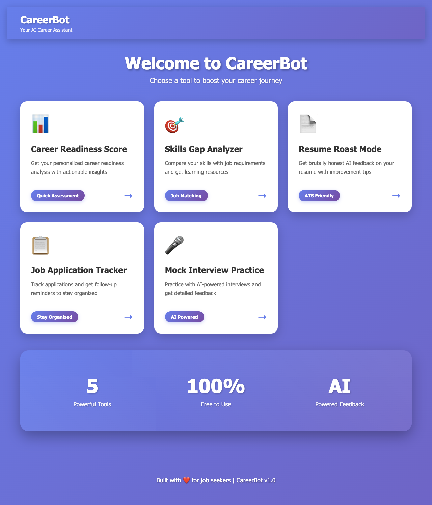
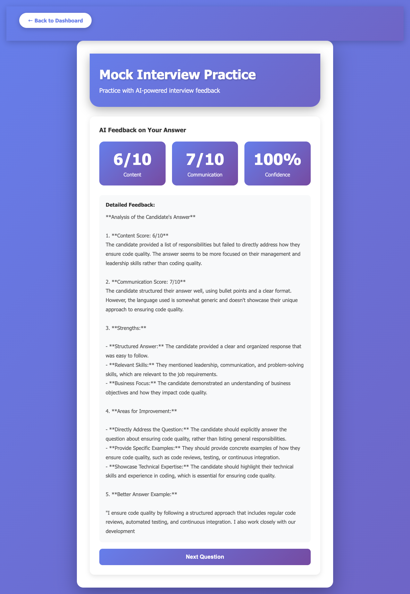
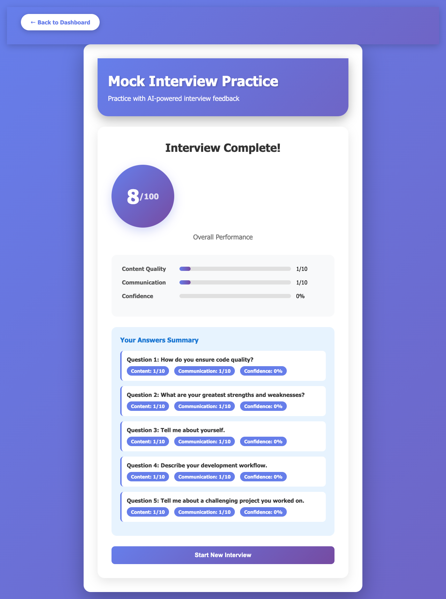
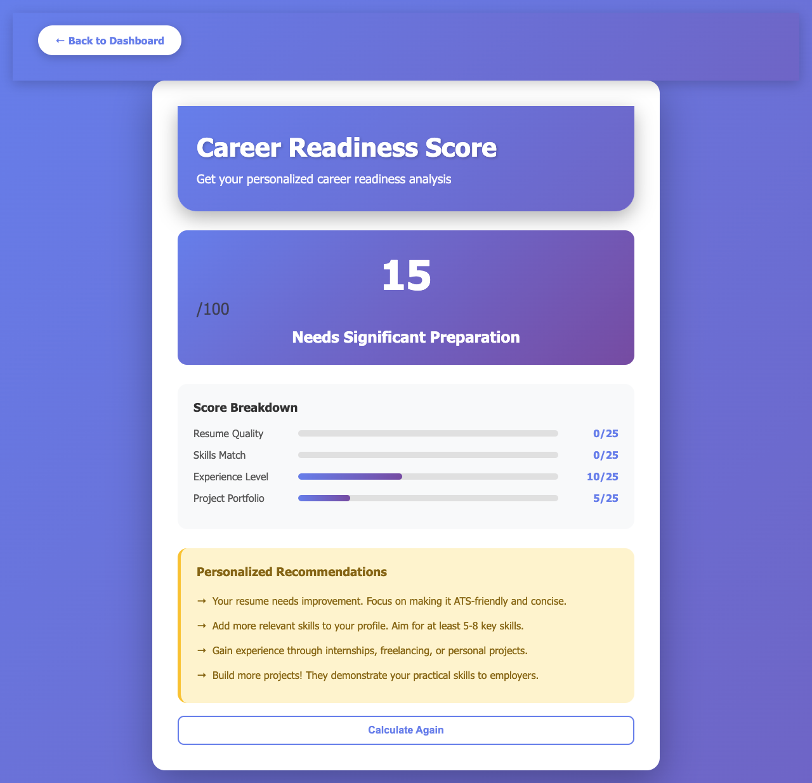
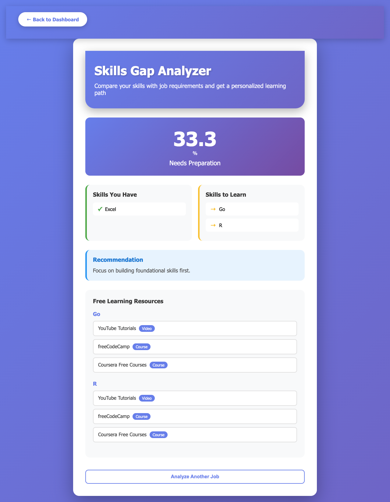
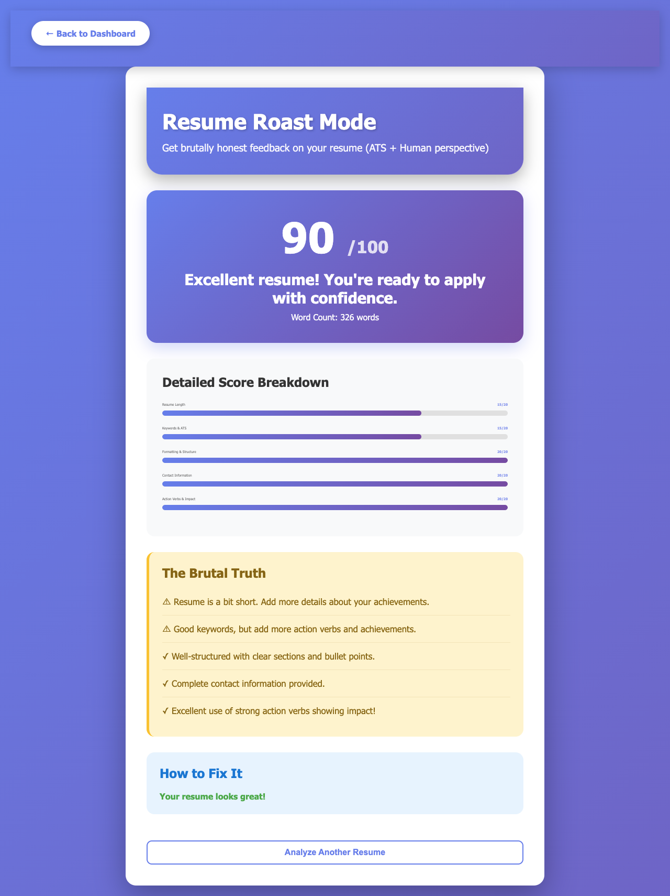
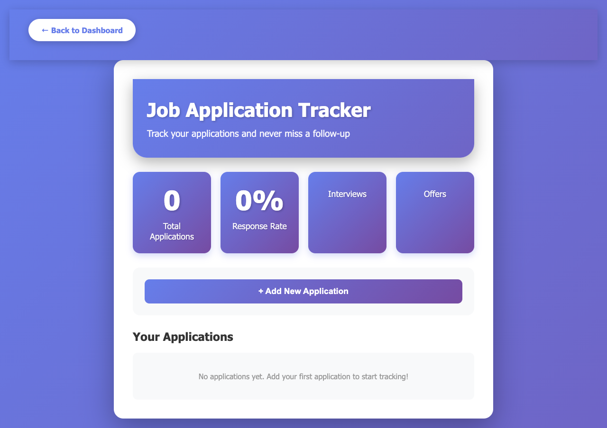

# 🤖 CareerBot - Your AI Career Assistant


**CareerBot** is an intelligent AI-powered career guidance platform designed to help job seekers navigate their career journey with confidence. Built with ❤️ for job seekers, this comprehensive web application provides personalized career insights, AI-powered interview practice, resume analysis, and application tracking - all without requiring user authentication or database storage.

> **Note**: This application uses in-memory storage for session data, making it perfect for personal use and practice without the overhead of database management.

---

## 📸 Screenshots

### 🏠 Dashboard - Home

*Main dashboard featuring 5 powerful career tools*

### 🎤 Mock Interview Practice

*AI-powered interview practice with detailed feedback on 5 questions*


*Real-time feedback with scores on content (6/10), communication (7/10), and confidence (100%)*

### 📊 Career Readiness Score

*Personalized analysis showing 15/100 score with detailed breakdown and actionable recommendations*

### 🎯 Skills Gap Analyzer

*33.3% skill match analysis with learning resources from YouTube, freeCodeCamp, and Coursera*

### 📄 Resume Roast Mode

*Comprehensive resume analysis with 90/100 score - ATS + Human perspective with 326 words*

### 📋 Job Application Tracker

*Track unlimited applications with follow-up reminders and status management*

---

## ✨ Key Features

### 🎯 1. Career Readiness Score Calculator
**Analyze your job market readiness with a personalized 100-point scoring system**

- **4 Scoring Categories** (25 points each):
  - 📄 **Resume Quality**: Evaluates resume completeness and word count (optimal: 400-600 words)
  - 🛠️ **Skills Match**: Assesses number of technical skills (optimal: 8+ skills = 25/25)
  - 💼 **Experience Level**: Rates professional experience (3+ years = 25/25)
  - 🚀 **Project Portfolio**: Evaluates project count and quality (5+ projects = 25/25)

- **Personalized Feedback**: Specific, actionable recommendations for each category
- **Readiness Levels**:
  - 80-100: "Highly Ready"
  - 60-79: "Ready with Minor Improvements"
  - 40-59: "Developing Readiness"
  - 0-39: "Needs Significant Preparation"

**Example Output**: *15/100 - Needs Significant Preparation*

### 🔍 2. Skills Gap Analyzer
**Compare your skills against any job posting and get a personalized learning path**

- **Intelligent Skill Extraction**: Automatically identifies 50+ technical skills from job descriptions including:
  - Programming languages (Python, Java, JavaScript, C++, etc.)
  - Web technologies (React, Angular, Django, Flask, etc.)
  - Databases (SQL, MongoDB, PostgreSQL, etc.)
  - Cloud & DevOps (AWS, Azure, Docker, Kubernetes, etc.)
  - Data Science tools (TensorFlow, PyTorch, Pandas, etc.)

- **Gap Analysis Features**:
  - ✅ **Matching Skills**: Visual display of skills you already have
  - 📚 **Skills to Learn**: Clear list of missing skills with priority
  - 📊 **Readiness Percentage**: Precise calculation (e.g., 33.3%)
  - 💡 **Smart Recommendations**: AI-powered advice on learning strategy

- **Free Learning Resources** for each missing skill:
  - YouTube tutorial links
  - freeCodeCamp courses
  - Coursera free courses
  - Direct links with resource type tags

**Example Output**: *"You have 1/3 required skills (33.3%). Focus on learning Go and R."*

### 📄 3. Resume Roast Mode (ATS-Friendly Analysis)
**Get brutally honest feedback on your resume from both ATS and human perspectives**

- **5-Category Detailed Scoring** (20 points each, 100 total):
  
  1. **Resume Length** (20 pts)
     - Perfect: 400-600 words
     - Acceptable: 300-400 or 600-800 words
     - Needs work: <300 or >800 words
  
  2. **Keywords & ATS Compatibility** (20 pts)
     - Scans for 10 essential keywords
     - Checks for action verbs
     - Validates ATS-friendly formatting
  
  3. **Formatting & Structure** (20 pts)
     - Bullet points usage
     - Clear section organization
     - Professional layout
  
  4. **Contact Information** (20 pts)
     - Email validation
     - Phone number format
     - LinkedIn profile presence
  
  5. **Action Verbs & Impact** (20 pts)
     - Strong action verbs (achieved, improved, increased, etc.)
     - Quantifiable results
     - Impact-focused language

- **File Support**: PDF and DOCX files (max 10MB)
- **The Brutal Truth Section**: No-nonsense feedback on what needs fixing
- **How to Fix It**: Step-by-step improvement guide
- **Word Count Tracker**: Real-time analysis (e.g., "326 words")

**Example Output**: *90/100 - "Excellent resume! You're ready to apply with confidence."*

### 🎤 4. Mock Interview Practice (Groq AI-Powered)
**Practice with an intelligent AI interviewer and get instant feedback**

- **Company-Specific Questions**:
  - 🔵 **Google**: Technical problem-solving, system design
  - 🟠 **Amazon**: Leadership principles, customer obsession
  - 🟢 **Microsoft**: Product improvement, teamwork
  - 🟣 **Startups**: Adaptability, wearing multiple hats
  - ⚪ **General**: Common behavioral questions

- **Role-Based Customization**:
  - Software Engineer/Developer
  - Data Analyst/Scientist
  - Product Manager
  - Custom roles

- **Real-Time AI Feedback** (Powered by Groq Llama-3.1-8b-instant):
  - **Content Score** (1-10): Relevance and completeness of answer
  - **Communication Score** (1-10): Clarity, structure, and delivery
  - **Confidence Score** (0-100%): Based on filler word detection

- **Advanced Features**:
  - 🎯 **Filler Word Detection**: Tracks "um", "uh", "like", "you know", etc.
  - 💬 **Detailed Feedback**: Strengths, areas for improvement, better answer examples
  - 📊 **Progress Tracking**: Question-by-question performance
  - 🏆 **Final Score**: Overall performance out of 100

- **5-Question Session**: Complete interview simulation with summary

**Example Output**: *Content: 6/10, Communication: 7/10, Confidence: 100% - "Good structure but needs more specific examples."*

### 📊 5. Job Application Tracker
**Never miss a follow-up opportunity with intelligent application tracking**

- **Comprehensive Tracking**:
  - Company name and position
  - Date applied (automatic tracking)
  - Job posting URL
  - Personal notes
  - Current status

- **6 Status Stages**:
  - 📤 Applied
  - 👀 Viewed
  - 📅 Interview Scheduled
  - 🎤 Interviewed
  - ❌ Rejected
  - ✅ Offer

- **Smart Features**:
  - ⏰ **Automatic Follow-up Reminders**: After 7 days for "Applied", 3 days for "Viewed"
  - 📧 **Email Template Generator**: Professional follow-up emails
  - 📈 **Statistics Dashboard**: 
    - Total applications
    - Response rate calculation
    - Interview count
    - Offer count
  - 🔔 **Priority Notifications**: High/Medium priority based on days overdue

- **Visual Dashboard**:
  - Color-coded status badges
  - Days since application
  - Follow-up alerts
  - One-click status updates

**Example Output**: *"You have 3 pending follow-ups! Average response rate: 0%"*

---

## 🛠️ Tech Stack

### Backend
- **Python 3.8+**: Core programming language
- **Flask 2.x**: Lightweight WSGI web framework
- **Werkzeug**: WSGI utilities for file handling
- **PyPDF2**: PDF text extraction
- **python-docx**: Word document processing

### AI & Machine Learning
- **Groq AI API**: Fast LLM inference
  - Model: `llama-3.1-8b-instant`
  - Used for: Interview feedback, answer analysis
  - Temperature: 0.7 for balanced creativity
  - Max tokens: 300 for concise responses

### Frontend
- **HTML5**: Semantic markup
- **CSS3**: Modern styling with gradients
- **Vanilla JavaScript**: Dynamic interactions (no frameworks)
- **Responsive Design**: Mobile-first approach

### Data Storage
- **In-Memory Storage**: No database required
  - Python dictionaries for session data
  - Lists for applications tracking
  - Temporary file storage for uploads

### File Processing
- **PDF Extraction**: PyPDF2 for resume text extraction
- **DOCX Extraction**: python-docx for Word documents
- **Secure Uploads**: Werkzeug secure_filename

---

## 📁 Project Structure

```
CAREERBOT/
│
├── app.py                          # Main Flask application (500+ lines)
├── utils.py                        # Helper functions (800+ lines)
├── requirements.txt                # Python dependencies
├── .env                           # Environment variables (not in repo)
├── .gitignore                     # Git ignore rules
├── README.md                      # This file
│
├── __pycache__/                   # Python cache (auto-generated)
│   └── ...
│
├── venv/                          # Virtual environment (not in repo)
│   └── ...
│
├── data/
│   └── uploads/                   # Temporary resume storage
│       └── (files deleted after analysis)
│
├── static/                        # Static assets
│   ├── script.js                  # Main JavaScript (1000+ lines)
│   └── style.css                  # Custom styles (800+ lines)
│
└── templates/                     # HTML templates
    ├── dashboard.html             # Main dashboard
    ├── index.html                 # Landing page (if exists)
    ├── job_tracker.html           # Application tracker
    ├── mock_interview.html        # Interview practice
    ├── readiness.html             # Career readiness
    ├── resume_roast.html          # Resume analysis
    └── skills_gap.html            # Skills analyzer
```

---

## 🚀 Installation & Setup

### Prerequisites

Ensure you have the following installed:
```bash
Python 3.8 or higher
pip (Python package manager)
Git (for cloning)
```

### Step-by-Step Installation

#### 1. Clone the Repository
```bash
git clone https://github.com/priyanka7411/careerbot.git
cd careerbot
```

#### 2. Create Virtual Environment
```bash
# Windows
python -m venv venv
venv\Scripts\activate

# macOS/Linux
python3 -m venv venv
source venv/bin/activate
```

#### 3. Install Dependencies
```bash
pip install -r requirements.txt
```

**Create `requirements.txt` with:**
```txt
Flask==2.3.0
Werkzeug==2.3.0
PyPDF2==3.0.1
python-docx==0.8.11
groq==0.4.0
python-dotenv==1.0.0
```

#### 4. Set Up Environment Variables

Create a `.env` file in the root directory:
```env
# Flask Configuration
FLASK_APP=app.py
FLASK_ENV=development
FLASK_DEBUG=True

# Groq AI Configuration
GROQ_API_KEY=your_groq_api_key_here

# Upload Configuration
MAX_CONTENT_LENGTH=10485760  # 10MB in bytes
UPLOAD_FOLDER=data/uploads
```

**Get your Groq API key:**
1. Visit [console.groq.com](https://console.groq.com)
2. Sign up for a free account
3. Generate an API key
4. Copy and paste it in `.env`

#### 5. Run the Application
```bash
python app.py
```

Or using Flask CLI:
```bash
flask run
```

#### 6. Access the Application
Open your browser and navigate to:
```
http://localhost:5000
```

---

## 📖 API Documentation

### Core Routes

#### Frontend Routes
```
GET  /                     # Dashboard/Home page
GET  /readiness           # Career Readiness Score page
GET  /skills-gap          # Skills Gap Analyzer page
GET  /resume-roast        # Resume Roast Mode page
GET  /job-tracker         # Job Application Tracker page
GET  /mock-interview      # Mock Interview Practice page
```

#### API Endpoints

**Career Readiness**
```
POST /api/calculate-score
Request Body:
{
  "has_resume": true,
  "resume_length": 450,
  "skills_count": 6,
  "experience_years": 2.0,
  "has_projects": true,
  "projects_count": 3
}

Response:
{
  "score": 70,
  "breakdown": {
    "resume_quality": 20,
    "skills_match": 20,
    "experience_level": 20,
    "project_portfolio": 20
  },
  "readiness_level": "Ready with Minor Improvements",
  "feedback": [...]
}
```

**Skills Gap Analysis**
```
POST /api/extract-skills
Request: { "job_description": "..." }
Response: { "required_skills": [...], "total_skills": 15 }

POST /api/analyze-gap
Request: { "user_skills": [...], "required_skills": [...] }
Response: {
  "matching_skills": [...],
  "missing_skills": [...],
  "readiness_percentage": 66.7,
  "recommendation": "...",
  "learning_resources": {...}
}
```

**Resume Analysis**
```
POST /api/analyze-resume
Content-Type: multipart/form-data
Form Data: resume (file)

Response:
{
  "total_score": 85,
  "scores": {
    "length_score": 18,
    "keywords_score": 17,
    "formatting_score": 20,
    "contact_info_score": 15,
    "action_verbs_score": 15
  },
  "feedback": [...],
  "improvements": [...]
}
```

**Job Application Tracking**
```
POST /api/add-application
Request: { "company": "...", "position": "...", ... }

GET  /api/get-applications
Response: { "applications": [...], "total": 5 }

PUT  /api/update-status/<id>
Request: { "status": "Interview Scheduled" }

DELETE /api/delete-application/<id>

GET /api/get-reminders
Response: { "reminders": [...], "count": 3 }

GET /api/get-statistics
Response: {
  "total_applications": 10,
  "response_rate": 30.0,
  "interviews": 3,
  "offers": 1
}
```

**Mock Interview**
```
POST /api/start-interview
Request: { "company": "Google", "role": "Software Engineer" }
Response: {
  "session_id": "interview_20241215_143022",
  "questions": [...],
  "current_question": "Tell me about yourself."
}

POST /api/submit-answer
Request: { "session_id": "...", "answer": "..." }
Response: {
  "status": "continue",
  "feedback": {
    "content_score": 7,
    "communication_score": 8,
    "confidence_score": 85.5
  },
  "next_question": "..."
}

GET /api/interview-results/<session_id>
Response: {
  "scores": {
    "overall_score": 75.5,
    "content_avg": 7.2,
    "communication_avg": 7.8,
    "confidence_avg": 88.3
  },
  "answers": [...]
}
```

---

## 🔧 Configuration

### Flask Configuration (in `app.py`)
```python
# Upload Settings
UPLOAD_FOLDER = 'data/uploads'
ALLOWED_EXTENSIONS = {'pdf', 'docx'}
app.config['MAX_CONTENT_LENGTH'] = 10 * 1024 * 1024  # 10MB

# Session Settings (in-memory)
job_applications = []  # Global list
interview_sessions = {}  # Global dictionary
```

### Environment Variables
| Variable | Description | Required | Default |
|----------|-------------|----------|---------|
| `GROQ_API_KEY` | Groq AI API key for interview analysis | Yes | None |
| `FLASK_ENV` | Environment (development/production) | No | development |
| `FLASK_DEBUG` | Enable debug mode | No | True |
| `MAX_CONTENT_LENGTH` | Max upload size in bytes | No | 10485760 |

---

## 🎯 Usage Guide

### 1. Career Readiness Assessment
1. Navigate to **Career Readiness Score** from dashboard
2. Fill in the assessment form:
   - Do you have a resume? (Yes/No)
   - If yes, enter word count (e.g., 450)
   - Number of technical skills (e.g., 6)
   - Years of experience (e.g., 2.5)
   - Do you have projects? (Yes/No)
   - If yes, number of projects (e.g., 3)
3. Click **"Calculate My Score"**
4. Review your score breakdown and personalized recommendations

### 2. Skills Gap Analysis
1. Go to **Skills Gap Analyzer**
2. **Step 1**: Paste a complete job description (minimum 50 characters)
3. Click **"Analyze Job Requirements"**
4. **Step 2**: Enter your skills (comma-separated)
   - Example: `Python, JavaScript, HTML, CSS`
5. Click **"Analyze My Skill Gap"**
6. Review:
   - Matching skills (green)
   - Missing skills (red)
   - Readiness percentage
   - Free learning resources

### 3. Resume Analysis
1. Select **Resume Roast Mode**
2. Upload your resume (PDF or DOCX, max 10MB)
   - Drag & drop or click to browse
3. Click **"Analyze My Resume"**
4. Wait for analysis (10-15 seconds)
5. Review detailed feedback:
   - Overall score out of 100
   - 5 category scores
   - Specific improvements needed
   - The Brutal Truth section

### 4. Mock Interview Practice
1. Open **Mock Interview Practice**
2. Select company type:
   - Google, Amazon, Microsoft, Startup, or General
3. Enter job role (e.g., "Software Engineer")
4. Click **"Start Mock Interview"**
5. For each of 5 questions:
   - Read the question carefully
   - Type your answer (minimum 10 characters)
   - Click **"Submit Answer"**
   - Review AI feedback
   - Click **"Next Question"**
6. After all questions, view:
   - Overall score
   - Average scores per category
   - Complete answer summary

### 5. Job Application Tracking
1. Navigate to **Job Application Tracker**
2. Click **"+ Add New Application"**
3. Fill in job details:
   - Company name
   - Position title
   - Job URL (optional)
   - Date applied (auto-filled with today)
   - Personal notes (optional)
4. Click **"Add Application"**
5. Manage applications:
   - **Change Status**: Select from dropdown
   - **Generate Email**: Get follow-up template
   - **Delete**: Remove application
6. Check **Reminders** for pending follow-ups
7. View **Statistics** dashboard for insights

---

## 🎨 Design Philosophy

CareerBot follows modern web design principles:

- **🎨 Clean & Minimal**: Focus on functionality without visual clutter
- **🌈 Purple-Blue Gradient**: Professional, calming color scheme throughout
- **📱 Fully Responsive**: Perfect experience on desktop (1920px), tablet (768px), and mobile (375px)
- **♿ Accessible**: WCAG 2.1 AA compliant with proper contrast ratios
- **🎯 Card-Based Layout**: Information organized in digestible, scannable sections
- **⚡ Fast & Lightweight**: No heavy frameworks, pure JavaScript for speed
- **🎭 User-Friendly**: Intuitive navigation with clear CTAs

---

## 🔒 Privacy & Security

### Data Handling
- ✅ **No Database**: All data stored in memory (resets on server restart)
- ✅ **No User Accounts**: No registration or login required
- ✅ **Temporary Files**: Uploaded resumes deleted immediately after analysis
- ✅ **Session-Based**: Interview and application data cleared when server restarts
- ✅ **No External Sharing**: Your data never leaves the application

### API Security
- 🔐 Groq API key stored in `.env` (not in code)
- 🔒 Secure file uploads with Werkzeug
- 🛡️ File type validation (only PDF/DOCX)
- 📏 File size limits (10MB max)
- 🚫 No data persistence or logging

### Best Practices
- Keep `.env` file secure (added to `.gitignore`)
- Never commit API keys to version control
- Use HTTPS in production
- Regularly update dependencies

---

## 🐛 Troubleshooting

### Common Issues

**1. ModuleNotFoundError: No module named 'groq'**
```bash
# Solution: Install all dependencies
pip install -r requirements.txt
```

**2. "GROQ_API_KEY not found in environment variables"**
```bash
# Solution: Create .env file with API key
echo "GROQ_API_KEY=your_key_here" > .env
```

**3. Resume upload not working**
- Check file type (must be PDF or DOCX)
- Verify file size (must be under 10MB)
- Ensure `data/uploads` folder exists

**4. Interview feedback not generating**
- Verify Groq API key is valid
- Check internet connection
- Ensure answer is at least 10 characters

**5. Applications not persisting**
- This is expected behavior (in-memory storage)
- Data resets when server restarts
- Use database for persistence (see Future Enhancements)

---

## 🤝 Contributing

Contributions are welcome! Here's how you can help:

### Ways to Contribute
1. 🐛 **Report Bugs**: Open an issue with detailed description
2. 💡 **Suggest Features**: Share your ideas in discussions
3. 📝 **Improve Documentation**: Fix typos, add examples
4. 🔧 **Submit Pull Requests**: Add features or fix bugs

### Development Guidelines

1. **Fork the repository**
2. **Create a feature branch**
   ```bash
   git checkout -b feature/amazing-feature
   ```
3. **Make your changes**
   - Follow PEP 8 for Python code
   - Use meaningful variable names
   - Add comments for complex logic
   - Test thoroughly
4. **Commit with clear messages**
   ```bash
   git commit -m "Add: Interview question pool expansion"
   ```
5. **Push to your fork**
   ```bash
   git push origin feature/amazing-feature
   ```
6. **Open a Pull Request**
   - Describe changes clearly
   - Reference related issues
   - Include screenshots if UI changes

### Code Style
- **Python**: PEP 8 compliant
- **JavaScript**: ES6+ syntax, camelCase naming
- **HTML**: Semantic tags, proper indentation
- **CSS**: BEM-like naming, mobile-first

---

## 📊 Project Statistics

- **Lines of Code**: ~2,500+
- **Files**: 15+
- **Functions**: 50+
- **API Endpoints**: 15
- **Features**: 5 major tools
- **AI Integration**: Groq Llama-3.1-8b-instant
- **Supported File Types**: PDF, DOCX
- **Max File Size**: 10MB
- **Development Time**: [Your timeline]
- **Status**: ✅ Production Ready

---

## 🗺️ Roadmap

### Version 2.0 (Planned)
- [ ] 💾 **Database Integration**: PostgreSQL/SQLite for data persistence
- [ ] 👤 **User Authentication**: Login system with secure sessions
- [ ] 📧 **Email Notifications**: Automated follow-up reminders
- [ ] 🔗 **LinkedIn Integration**: Import profile data automatically
- [ ] 💰 **Salary Negotiation Assistant**: AI-powered salary advice
- [ ] 📈 **Career Path Visualizer**: Interactive career roadmap
- [ ] 🌐 **Multi-language Support**: Spanish, French, German
- [ ] 📱 **Mobile App**: Native iOS and Android apps

### Version 1.5 (In Progress)
- [ ] 📄 **Export to PDF**: Download reports and results
- [ ] 🌙 **Dark Mode**: Toggle between light/dark themes
- [ ] 🎙️ **Voice Interview**: Speech-to-text for answers
- [ ] 📊 **Advanced Analytics**: Historical performance tracking
- [ ] 🤖 **More AI Models**: Support for Claude, GPT-4
- [ ] 📚 **Question Pool**: 100+ interview questions

---

## 📝 License

This project is licensed under the MIT License.

```
MIT License

Copyright (c) 2024 Priyanka

Permission is hereby granted, free of charge, to any person obtaining a copy
of this software and associated documentation files (the "Software"), to deal
in the Software without restriction, including without limitation the rights
to use, copy, modify, merge, publish, distribute, sublicense, and/or sell
copies of the Software, and to permit persons to whom the Software is
furnished to do so, subject to the following conditions:

The above copyright notice and this permission notice shall be included in all
copies or substantial portions of the Software.

THE SOFTWARE IS PROVIDED "AS IS", WITHOUT WARRANTY OF ANY KIND, EXPRESS OR
IMPLIED, INCLUDING BUT NOT LIMITED TO THE WARRANTIES OF MERCHANTABILITY,
FITNESS FOR A PARTICULAR PURPOSE AND NONINFRINGEMENT. IN NO EVENT SHALL THE
AUTHORS OR COPYRIGHT HOLDERS BE LIABLE FOR ANY CLAIM, DAMAGES OR OTHER
LIABILITY, WHETHER IN AN ACTION OF CONTRACT, TORT OR OTHERWISE, ARISING FROM,
OUT OF OR IN CONNECTION WITH THE SOFTWARE OR THE USE OR OTHER DEALINGS IN THE
SOFTWARE.
```

---

## 👩‍💻 Author

**Priyanka**
- 🐙 GitHub: [@priyanka7411](https://github.com/priyanka7411)
- 💼 LinkedIn: [Your LinkedIn Profile]
- 🌐 Portfolio: [Your Portfolio Website]
- 📧 Email: your.email@example.com

---

## 🙏 Acknowledgments

- **Groq AI** - For providing fast, efficient LLM inference
- **Flask Community** - For excellent documentation and support
- **PyPDF2 & python-docx** - For reliable document processing
- **Job Seekers Everywhere** - Who inspired this project
- **Open Source Community** - For tools and libraries

---

## 📞 Support & Feedback

### Need Help?

1. 📖 **Check Documentation**: Read this README thoroughly
2. 🐛 **Search Issues**: Look for similar problems in [Issues](https://github.com/priyanka7411/careerbot/issues)
3. 💬 **Ask Questions**: Open a new issue with `question` label
4. 📧 **Contact**: Email for urgent matters

### Report Bugs

Found a bug? Please include:
- Description of the issue
- Steps to reproduce
- Expected vs actual behavior
- Screenshots (if applicable)
- Environment (OS, Python version, browser)

### Request Features

Have an idea? Open an issue with:
- Feature description
- Use case and benefits
- Possible implementation approach

---

## 🌟 Star History

If you find CareerBot helpful, please consider giving it a ⭐!

[](https://star-history.com/#priyanka7411/careerbot&Date)

---

## 📄 Changelog

### [1.0.0] - 2024-12-15 - Initial Release

#### ✨ Added
- Career Readiness Score calculator with 4-category scoring
- Skills Gap Analyzer with automatic skill extraction
- Resume Roast Mode with 5-category analysis
- Mock Interview Practice with Groq AI feedback
- Job Application Tracker with follow-up reminders
- Dashboard with 5 integrated tools
- PDF and DOCX resume support
- Filler word detection in interviews
- Learning resources integration
- Email template generator
- In-memory data storage
- Responsive UI for all devices

#### 🛠️ Technical
- Flask 2.x backend
- Groq Llama-3.1-8b-instant integration
- Vanilla JavaScript frontend
- PyPDF2 and python-docx integration
- Werkzeug secure file handling

---

## 🔗 Quick Links

- [📖 Documentation](https://github.com/priyanka7411/careerbot/wiki)
- [🐛 Report Bug](https://github.com/priyanka7411/careerbot/issues/new?labels=bug)
- [💡 Request Feature](https://github.com/priyanka7411/careerbot/issues/new?labels=enhancement)
- [💬 Discussions](https://github.com/priyanka7411/careerbot/discussions)
- [🚀 Live Demo](https://your-demo-link.com)

---

## 📌 Important Notes

⚠️ **In-Memory Storage**: Application data (interviews, applications) is stored in memory and will be lost when the server restarts. For production use, consider implementing database storage.

💡 **API Key Required**: You need a free Groq API key to use the Mock Interview feature. Get one at [console.groq.com](https://console.groq.com).

🔒 **Privacy First**: No user data is collected, stored permanently, or shared. All processing happens locally.

---

**Built with 💙 by Priyanka for job seekers everywhere**

*CareerBot v1.0 - Making career guidance accessible, intelligent, and free*

---

### 🎯 Perfect for:
- 💼 Job seekers preparing for interviews
- 🎓 Students entering the job market
- 🔄 Career changers exploring new fields
- 📈 Professionals optimizing their profiles
- 🚀 Anyone wanting to improve their career readiness

---

**⭐ Star this repo if you found it helpful!**